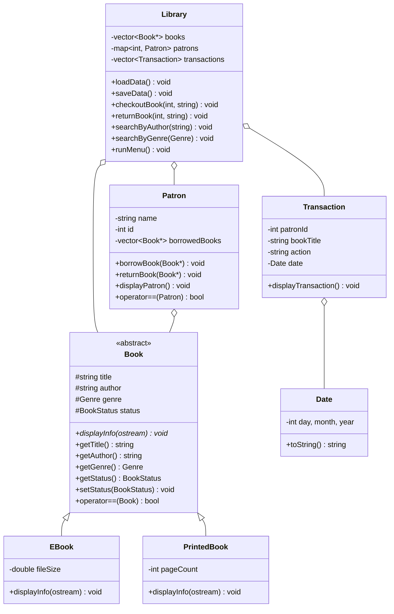
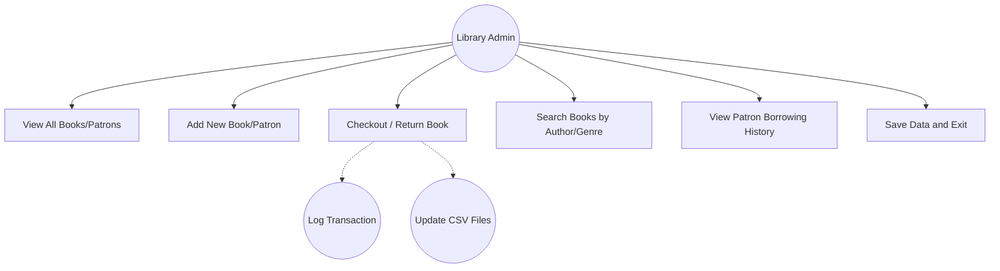

# M08A Final Project: Library Management System

## Assignment Description
The Library Management System is a robust C++ application designed to handle the core operations of a library. It manages a diverse collection of books (including E-Books and Printed Books), keeps track of patrons, and logs all check-out and return transactions. The project is built using Object-Oriented Programming (OOP) principles, featuring inheritance for different book types, polymorphism for dynamic information display, and operator overloading for intuitive comparisons. It also incorporates data persistence via CSV files, custom exception handling for robust error management, and a template-based file I/O system.

## 1 Readme Documentation
### General Inputs and Outputs
**Inputs:**
*   **Menu Navigation:** Integer inputs for selecting system operations.
*   **Book Creation:** String inputs for Title and Author; Enum-based selection for Genre; Type-specific numeric inputs for Page Count (Printed) or File Size (E-Book).
*   **Patron Management:** Name (string) and unique ID (integer).
*   **Transaction Processing:** Patron ID and Book Title to facilitate borrowing and returning.
*   **Search Operations:** Author name or Genre category to filter the book collection.
*   **Data Files:** `books.txt` and `patrons.txt` serve as persistent data sources.

**Outputs:**
*   **Console Display:** Formatted tables and lists of books, patrons, and their statuses.
*   **Status Updates:** Immediate feedback on successful transactions or detailed error reports for failed operations.
*   **Transaction Logs:** Sequential recording of all events in `transactions.log`.
*   **Persistent Storage:** Auto-updated text files ensuring data is saved between application runs.

---

## 2 Flowchart Screen Shots or Pseudocode
### Core Application Logic (Pseudocode)
```text
FUNCTION main():
    INITIALIZE Library object
    TRY:
        Library.loadData()
    CATCH:
        DISPLAY "Starting with empty library"
    
    WHILE True:
        DISPLAY Main Menu
        INPUT choice
        
        SWITCH choice:
            CASE 1: Library.displayBooks()
            CASE 2: Library.displayPatrons()
            CASE 3: 
                INPUT book details
                Library.addBook(New Book Object)
            CASE 4:
                INPUT patron details
                Library.addPatron(New Patron Object)
            CASE 5:
                INPUT patronId, bookTitle
                TRY: Library.checkoutBook(patronId, bookTitle)
                CATCH: DISPLAY Error
            CASE 6:
                INPUT patronId, bookTitle
                TRY: Library.returnBook(patronId, bookTitle)
                CATCH: DISPLAY Error
            CASE 7:
                INPUT searchType (Author/Genre)
                Library.searchBooks(...)
            CASE 8:
                INPUT patronId
                Library.displayPatron(patronId)
            CASE 9:
                Library.saveData()
                EXIT Program
        END SWITCH
    END WHILE
END FUNCTION
```

---

## 3 UML and Use Case Diagrams

### UML Class Diagram


### Use Case Diagram


---

## 4 Source Code of All files

### Book.h
```cpp
#ifndef BOOK_H
#define BOOK_H

#include <string>
#include <iostream>

// groups related constants together
enum Genre { FICTION, NON_FICTION, MYSTERY, ROMANCE, SCI_FI, BIOGRAPHY };

// keeps track of book availability
enum BookStatus { AVAILABLE, CHECKED_OUT, RESERVED };

// base class for all books - handles common stuff
class Book {
protected:
    std::string title;
    std::string author;
    Genre genre;
    BookStatus status;

public:
    Book(const std::string& t, const std::string& a, Genre g);
    
    virtual ~Book() = default;
    
    // lets subclasses show their info differently
    virtual void displayInfo(std::ostream& os) const = 0;
    
    const std::string& getTitle() const { return title; }
    const std::string& getAuthor() const { return author; }
    Genre getGenre() const { return genre; }
    BookStatus getStatus() const { return status; }
    
    void setStatus(BookStatus s) { status = s; }
    
    // checks if two books are the same based on title and author
    bool operator==(const Book& other) const {
        return title == other.title && author == other.author;
    }
    
    friend std::ostream& operator<<(std::ostream& os, const Book& book);
};

// ebook version - adds file size
class EBook : public Book {
private:
    double fileSize;

public:
    EBook(const std::string& t, const std::string& a, Genre g, double fs);
    
    void displayInfo(std::ostream& os) const override;
    
    double getFileSize() const { return fileSize; }
};

// printed book version - adds page count
class PrintedBook : public Book {
private:
    int pageCount;

public:
    PrintedBook(const std::string& t, const std::string& a, Genre g, int pc);
    
    void displayInfo(std::ostream& os) const override;
    
    int getPageCount() const { return pageCount; }
};

// helper functions for converting enums to strings
std::string genreToString(Genre g);
std::string statusToString(BookStatus s);

#endif // BOOK_H
```

### Book.cpp
```cpp
#include "Book.h"

// sets up a book with basic info
Book::Book(const std::string& t, const std::string& a, Genre g)
    : title(t), author(a), genre(g), status(AVAILABLE) {}

EBook::EBook(const std::string& t, const std::string& a, Genre g, double fs)
    : Book(t, a, g), fileSize(fs) {}

PrintedBook::PrintedBook(const std::string& t, const std::string& a, Genre g, int pc)
    : Book(t, a, g), pageCount(pc) {}

// lets us print books easily
std::ostream& operator<<(std::ostream& os, const Book& book) {
    book.displayInfo(os);
    return os;
}

// shows ebook details
void EBook::displayInfo(std::ostream& os) const {
    os << "EBook - Title: " << title << ", Author: " << author 
       << ", Genre: " << genreToString(genre) 
       << ", File Size: " << fileSize << " MB, Status: " << statusToString(status) << std::endl;
}

// shows printed book details
void PrintedBook::displayInfo(std::ostream& os) const {
    os << "PrintedBook - Title: " << title << ", Author: " << author 
       << ", Genre: " << genreToString(genre) 
       << ", Pages: " << pageCount << ", Status: " << statusToString(status) << std::endl;
}

// turns genre enum into readable string
std::string genreToString(Genre g) {
    switch(g) {
        case FICTION: return "FICTION";
        case NON_FICTION: return "NON_FICTION";
        case MYSTERY: return "MYSTERY";
        case ROMANCE: return "ROMANCE";
        case SCI_FI: return "SCI_FI";
        case BIOGRAPHY: return "BIOGRAPHY";
        default: return "UNKNOWN";
    }
}

// turns status enum into readable string
std::string statusToString(BookStatus s) {
    switch(s) {
        case AVAILABLE: return "AVAILABLE";
        case CHECKED_OUT: return "CHECKED_OUT";
        case RESERVED: return "RESERVED";
        default: return "UNKNOWN";
    }
}
```

### Patron.h
```cpp
#ifndef PATRON_H
#define PATRON_H

#include <string>
#include <iostream>
#include <vector>
#include "Book.h"

// represents a library user
class Patron {
private:
    std::string name;
    int id;
    std::vector<Book*> borrowedBooks;

public:
    Patron(const std::string& n = "", int i = 0);
    
    const std::string& getName() const { return name; }
    int getId() const { return id; }
    
    void borrowBook(Book* b);
    void returnBook(Book* b);
    void displayPatron() const;

    // checks if two patrons are the same by id
    bool operator==(const Patron& other) const {
        return id == other.id;
    }
    
    friend std::ostream& operator<<(std::ostream& os, const Patron& p);
};

#endif // PATRON_H
```

### Patron.cpp
```cpp
#include "Patron.h"
#include <iostream>
#include <algorithm>

Patron::Patron(const std::string& n, int i) : name(n), id(i) {}

void Patron::borrowBook(Book* b) {
    if (b) {
        borrowedBooks.push_back(b);
    }
}

void Patron::returnBook(Book* b) {
    auto it = std::find(borrowedBooks.begin(), borrowedBooks.end(), b);
    if (it != borrowedBooks.end()) {
        borrowedBooks.erase(it);
    }
}

void Patron::displayPatron() const {
    std::cout << "Patron ID: " << id << ", Name: " << name << "\nBorrowed Books: ";
    if (borrowedBooks.empty()) {
        std::cout << "None";
    } else {
        for (const auto& book : borrowedBooks) {
            std::cout << "\n  - " << book->getTitle();
        }
    }
    std::cout << std::endl;
}

std::ostream& operator<<(std::ostream& os, const Patron& p) {
    os << "ID: " << p.id << ", Name: " << p.name;
    return os;
}
```

### Transaction.h
```cpp
#ifndef TRANSACTION_H
#define TRANSACTION_H

#include <string>
#include <ctime>
#include "Date.h"

// records what happens with books
class Transaction {
private:
    int patronId;
    std::string bookTitle;
    std::string action; // "checkout" or "return"
    Date date;

public:
    Transaction(int pid, const std::string& bt, const std::string& act, const Date& d);
    
    void displayTransaction() const;
    
    int getPatronId() const { return patronId; }
    const std::string& getBookTitle() const { return bookTitle; }
    const std::string& getAction() const { return action; }
    Date getDate() const { return date; }
};

#endif // TRANSACTION_H
```

### Transaction.cpp
```cpp
#include "Transaction.h"
#include <iostream>

Transaction::Transaction(int pid, const std::string& bt, const std::string& act, const Date& d)
    : patronId(pid), bookTitle(bt), action(act), date(d) {}

void Transaction::displayTransaction() const {
    std::cout << "Date: " << date << " | Patron ID: " << patronId 
              << " | Book: " << bookTitle << " | Action: " << action << std::endl;
}
```

### Library.h
```cpp
#ifndef LIBRARY_H
#define LIBRARY_H

#include "Book.h"
#include "Patron.h"
#include "Transaction.h"
#include <vector>
#include <map>
#include <string>
#include <stdexcept>

// custom error for library stuff
class LibraryException : public std::exception {
private:
    std::string message;
public:
    LibraryException(const std::string& msg) : message(msg) {}
    const char* what() const noexcept override {
        return message.c_str();
    }
};

// main library manager - holds books and patrons
class Library {
private:
    std::vector<Book*> books;
    std::map<int, Patron> patrons;
    std::vector<Transaction> transactions;
    
    std::string booksFile = "books.txt";
    std::string patronsFile = "patrons.txt";
    std::string logFile = "transactions.log";

public:
    ~Library();
    
    void loadData();
    void saveData();
    
    void displayBooks() const;
    void displayPatrons() const;
    
    void addBook(Book* book);
    void addPatron(const Patron& patron);
    
    void checkoutBook(int patronId, const std::string& title);
    void returnBook(int patronId, const std::string& title);
    
    void searchByAuthor(const std::string& author) const;
    void searchByGenre(Genre genre) const;
    
    void runMenu();

private:
    Book* findBook(const std::string& title);
    Patron* findPatron(int id);
    void logTransaction(const Transaction& t);
    
    template<typename T>
    void loadFromCSV(const std::string& filename, T loader);
    
    template<typename T, typename U>
    void saveToCSV(const std::string& filename, const T& items, U saver);
    
    void saveBooksToCSV();
    void savePatronsToCSV();
    
    Genre stringToGenre(const std::string& str);
    BookStatus stringToStatus(const std::string& str);
};

#endif // LIBRARY_H
```

### Library.cpp
```cpp
#include "Library.h"
#include <iostream>
#include <fstream>
#include <sstream>
#include <algorithm>
#include <limits>

// cleans up book pointers
Library::~Library() {
    for (auto book : books) {
        delete book;
    }
    books.clear();
}

// loads data from files
void Library::loadData() {
    try {
        loadFromCSV(booksFile, [this](std::istringstream& iss) {
            std::string type, title, author, genreStr, extra, statusStr;
            std::getline(iss, type, ',');
            std::getline(iss, title, ',');
            std::getline(iss, author, ',');
            std::getline(iss, genreStr, ',');
            std::getline(iss, extra, ',');
            std::getline(iss, statusStr);
            
            Genre genre = stringToGenre(genreStr);
            BookStatus status = stringToStatus(statusStr);
            
            Book* book = nullptr;
            if (type == "EBook") {
                double fileSize = std::stod(extra);
                book = new EBook(title, author, genre, fileSize);
            } else if (type == "PrintedBook") {
                int pageCount = std::stoi(extra);
                book = new PrintedBook(title, author, genre, pageCount);
            }
            
            if (book) {
                book->setStatus(status);
                books.push_back(book);
            }
        });
        
        loadFromCSV(patronsFile, [this](std::istringstream& iss) {
            std::string idStr, name;
            std::getline(iss, idStr, ',');
            std::getline(iss, name);
            
            int id = std::stoi(idStr);
            patrons[id] = Patron(name, id);
        });
        
    } catch (const std::exception& e) {
        throw LibraryException("Error loading data: " + std::string(e.what()));
    }
}

// template for loading csv files
template<typename T>
void Library::loadFromCSV(const std::string& filename, T loader) {
    std::ifstream file(filename);
    if (!file.is_open()) {
        throw LibraryException("Cannot open file: " + filename);
    }
    
    std::string line;
    while (std::getline(file, line)) {
        if (line.empty()) continue;
        std::istringstream iss(line);
        loader(iss);
    }
    file.close();
}

void Library::saveData() {
    try {
        saveBooksToCSV();
        savePatronsToCSV();
    } catch (const std::exception& e) {
        throw LibraryException("Error saving data: " + std::string(e.what()));
    }
}

// template for saving items to csv
template<typename T, typename U>
void Library::saveToCSV(const std::string& filename, const T& items, U saver) {
    std::ofstream file(filename);
    if (!file.is_open()) {
        throw LibraryException("Cannot open file for writing: " + filename);
    }
    for (const auto& item : items) {
        saver(file, item);
    }
    file.close();
}

// saves books as csv
void Library::saveBooksToCSV() {
    saveToCSV(booksFile, books, [](std::ofstream& file, Book* book) {
        std::string type = dynamic_cast<EBook*>(book) ? "EBook" : "PrintedBook";
        file << type << "," << book->getTitle() << "," << book->getAuthor() << ","
             << genreToString(book->getGenre()) << ",";
        
        if (auto ebook = dynamic_cast<EBook*>(book)) {
            file << ebook->getFileSize();
        } else if (auto pbook = dynamic_cast<PrintedBook*>(book)) {
            file << pbook->getPageCount();
        }
        
        file << "," << statusToString(book->getStatus()) << std::endl;
    });
}

// saves patrons as csv
void Library::savePatronsToCSV() {
    saveToCSV(patronsFile, patrons, [](std::ofstream& file, const std::pair<const int, Patron>& pair) {
        file << pair.first << "," << pair.second.getName() << std::endl;
    });
}

// shows all books
void Library::displayBooks() const {
    if (books.empty()) {
        std::cout << "No books in the library." << std::endl;
        return;
    }
    
    std::cout << "\n=== Library Books ===" << std::endl;
    for (const auto book : books) {
        std::cout << *book;
    }
}

// shows all patrons
void Library::displayPatrons() const {
    if (patrons.empty()) {
        std::cout << "No patrons in the library." << std::endl;
        return;
    }
    
    std::cout << "\n=== Library Patrons ===" << std::endl;
    for (const auto& pair : patrons) {
        std::cout << pair.second << std::endl;
    }
}

// adds a book
void Library::addBook(Book* book) {
    if (!book) return;
    books.push_back(book);
}

// adds a patron
void Library::addPatron(const Patron& patron) {
    patrons[patron.getId()] = patron;
}

// checks out a book
void Library::checkoutBook(int patronId, const std::string& title) {
    Patron* patron = findPatron(patronId);
    if (!patron) {
        throw LibraryException("Patron with ID " + std::to_string(patronId) + " not found");
    }
    
    Book* book = findBook(title);
    if (!book) {
        throw LibraryException("Book '" + title + "' not found");
    }
    
    if (book->getStatus() != AVAILABLE) {
        throw LibraryException("Book '" + title + "' is not available");
    }
    
    book->setStatus(CHECKED_OUT);
    patron->borrowBook(book);
    
    Transaction t(patronId, title, "checkout", Date::getCurrentDate());
    transactions.push_back(t);
    logTransaction(t);
}

// returns a book
void Library::returnBook(int patronId, const std::string& title) {
    Patron* patron = findPatron(patronId);
    if (!patron) {
        throw LibraryException("Patron with ID " + std::to_string(patronId) + " not found");
    }
    
    Book* book = findBook(title);
    if (!book) {
        throw LibraryException("Book '" + title + "' not found");
    }
    
    if (book->getStatus() != CHECKED_OUT) {
        throw LibraryException("Book '" + title + "' is not checked out");
    }
    
    book->setStatus(AVAILABLE);
    patron->returnBook(book);
    
    Transaction t(patronId, title, "return", Date::getCurrentDate());
    transactions.push_back(t);
    logTransaction(t);
}

void Library::searchByAuthor(const std::string& author) const {
    std::cout << "\n=== Books by Author: " << author << " ===" << std::endl;
    bool found = false;
    for (const auto& book : books) {
        if (book->getAuthor() == author) {
            std::cout << *book;
            found = true;
        }
    }
    if (!found) std::cout << "No books found by this author." << std::endl;
}

void Library::searchByGenre(Genre genre) const {
    std::cout << "\n=== Books by Genre: " << genreToString(genre) << " ===" << std::endl;
    bool found = false;
    for (const auto& book : books) {
        if (book->getGenre() == genre) {
            std::cout << *book;
            found = true;
        }
    }
    if (!found) std::cout << "No books found in this genre." << std::endl;
}

// main menu loop
void Library::runMenu() {
    while (true) {
        std::cout << "\n===== Library Menu =====" << std::endl;
        std::cout << "1. View Books" << std::endl;
        std::cout << "2. View Patrons" << std::endl;
        std::cout << "3. Add Book" << std::endl;
        std::cout << "4. Add Patron" << std::endl;
        std::cout << "5. Checkout Book" << std::endl;
        std::cout << "6. Return Book" << std::endl;
        std::cout << "7. Search Books" << std::endl;
        std::cout << "8. View Patron Details" << std::endl;
        std::cout << "9. Exit" << std::endl;
        std::cout << "Enter choice: ";
        
        int choice;
        if (!(std::cin >> choice)) {
            std::cin.clear();
            std::cin.ignore(std::numeric_limits<std::streamsize>::max(), '\n');
            std::cout << "Invalid input. Please enter a number." << std::endl;
            continue;
        }
        std::cin.ignore(std::numeric_limits<std::streamsize>::max(), '\n');
        
        try {
            switch (choice) {
                case 1:
                    displayBooks();
                    break;
                case 2:
                    displayPatrons();
                    break;
                case 3: {
                    std::string title, author, genreStr, type;
                    std::cout << "Enter title: ";
                    std::getline(std::cin, title);
                    std::cout << "Enter author: ";
                    std::getline(std::cin, author);
                    std::cout << "Enter genre (FICTION, NON_FICTION, MYSTERY, ROMANCE, SCI_FI, BIOGRAPHY): ";
                    std::getline(std::cin, genreStr);
                    std::cout << "Enter type (EBook or PrintedBook): ";
                    std::getline(std::cin, type);
                    
                    Genre genre = stringToGenre(genreStr);
                    Book* book = nullptr;
                    
                    if (type == "EBook") {
                        double fileSize;
                        std::cout << "Enter file size (MB): ";
                        while (!(std::cin >> fileSize)) {
                            std::cin.clear();
                            std::cin.ignore(std::numeric_limits<std::streamsize>::max(), '\n');
                            std::cout << "Invalid input. Please enter a numeric value for file size: ";
                        }
                        std::cin.ignore(std::numeric_limits<std::streamsize>::max(), '\n');
                        book = new EBook(title, author, genre, fileSize);
                    } else if (type == "PrintedBook") {
                        int pageCount;
                        std::cout << "Enter page count: ";
                        while (!(std::cin >> pageCount)) {
                            std::cin.clear();
                            std::cin.ignore(std::numeric_limits<std::streamsize>::max(), '\n');
                            std::cout << "Invalid input. Please enter a numeric value for page count: ";
                        }
                        std::cin.ignore(std::numeric_limits<std::streamsize>::max(), '\n');
                        book = new PrintedBook(title, author, genre, pageCount);
                    } else {
                        std::cout << "Invalid book type." << std::endl;
                        break;
                    }
                    
                    addBook(book);
                    std::cout << "Book added successfully." << std::endl;
                    break;
                }
                case 4: {
                    std::string name;
                    int id;
                    std::cout << "Enter patron name: ";
                    std::getline(std::cin, name);
                    std::cout << "Enter patron ID: ";
                    while (!(std::cin >> id)) {
                        std::cin.clear();
                        std::cin.ignore(std::numeric_limits<std::streamsize>::max(), '\n');
                        std::cout << "Invalid ID. Please enter a numeric value for patron ID: ";
                    }
                    std::cin.ignore(std::numeric_limits<std::streamsize>::max(), '\n');
                    
                    Patron patron(name, id);
                    addPatron(patron);
                    std::cout << "Patron added successfully." << std::endl;
                    break;
                }
                case 5: {
                    int patronId;
                    std::string title;
                    std::cout << "Enter patron ID: ";
                    while (!(std::cin >> patronId)) {
                        std::cin.clear();
                        std::cin.ignore(std::numeric_limits<std::streamsize>::max(), '\n');
                        std::cout << "Invalid ID. Please enter a numeric value for patron ID: ";
                    }
                    std::cin.ignore(std::numeric_limits<std::streamsize>::max(), '\n');
                    std::cout << "Enter book title: ";
                    std::getline(std::cin, title);
                    
                    checkoutBook(patronId, title);
                    std::cout << "Book checked out successfully." << std::endl;
                    break;
                }
                case 6: {
                    int patronId;
                    std::string title;
                    std::cout << "Enter patron ID: ";
                    while (!(std::cin >> patronId)) {
                        std::cin.clear();
                        std::cin.ignore(std::numeric_limits<std::streamsize>::max(), '\n');
                        std::cout << "Invalid ID. Please enter a numeric value for patron ID: ";
                    }
                    std::cin.ignore(std::numeric_limits<std::streamsize>::max(), '\n');
                    std::cout << "Enter book title: ";
                    std::getline(std::cin, title);
                    
                    returnBook(patronId, title);
                    std::cout << "Book returned successfully." << std::endl;
                    break;
                }
                case 7: {
                    std::cout << "Search by: 1. Author, 2. Genre: ";
                    int searchChoice;
                    while (!(std::cin >> searchChoice)) {
                        std::cin.clear();
                        std::cin.ignore(std::numeric_limits<std::streamsize>::max(), '\n');
                        std::cout << "Invalid input. Please enter 1 or 2: ";
                    }
                    std::cin.ignore(std::numeric_limits<std::streamsize>::max(), '\n');
                    if (searchChoice == 1) {
                        std::string author;
                        std::cout << "Enter author name: ";
                        std::getline(std::cin, author);
                        searchByAuthor(author);
                    } else if (searchChoice == 2) {
                        std::string genreStr;
                        std::cout << "Enter genre (FICTION, NON_FICTION, MYSTERY, ROMANCE, SCI_FI, BIOGRAPHY): ";
                        std::getline(std::cin, genreStr);
                        searchByGenre(stringToGenre(genreStr));
                    } else {
                        std::cout << "Invalid search option." << std::endl;
                    }
                    break;
                }
                case 8: {
                    int patronId;
                    std::cout << "Enter patron ID: ";
                    while (!(std::cin >> patronId)) {
                        std::cin.clear();
                        std::cin.ignore(std::numeric_limits<std::streamsize>::max(), '\n');
                        std::cout << "Invalid ID. Please enter a numeric value for patron ID: ";
                    }
                    std::cin.ignore(std::numeric_limits<std::streamsize>::max(), '\n');
                    Patron* p = findPatron(patronId);
                    if (p) p->displayPatron();
                    else std::cout << "Patron not found." << std::endl;
                    break;
                }
                case 9:
                    saveData();
                    std::cout << "Data saved successfully. Exiting..." << std::endl;
                    return;
                default:
                    std::cout << "Invalid option. Please try again." << std::endl;
            }
        } catch (const LibraryException& e) {
            std::cout << "Error: " << e.what() << std::endl;
        } catch (const std::exception& e) {
            std::cout << "Unexpected error: " << e.what() << std::endl;
        }
    }
}

// finds a book by title
Book* Library::findBook(const std::string& title) {
    auto it = std::find_if(books.begin(), books.end(), 
        [&title](const Book* book) { return book->getTitle() == title; });
    return it != books.end() ? *it : nullptr;
}

// finds a patron by id
Patron* Library::findPatron(int id) {
    auto it = patrons.find(id);
    return it != patrons.end() ? &it->second : nullptr;
}

// logs a transaction to file
void Library::logTransaction(const Transaction& t) {
    std::ofstream file(logFile, std::ios::app);
    if (file.is_open()) {
        file << t.getDate() << "," << t.getPatronId() << "," 
             << t.getBookTitle() << "," << t.getAction() << std::endl;
        file.close();
    }
}

// converts string to genre
Genre Library::stringToGenre(const std::string& str) {
    if (str == "FICTION") return FICTION;
    if (str == "NON_FICTION") return NON_FICTION;
    if (str == "MYSTERY") return MYSTERY;
    if (str == "ROMANCE") return ROMANCE;
    if (str == "SCI_FI") return SCI_FI;
    if (str == "BIOGRAPHY") return BIOGRAPHY;
    return FICTION;
}

// converts string to status
BookStatus Library::stringToStatus(const std::string& str) {
    if (str == "AVAILABLE") return AVAILABLE;
    if (str == "CHECKED_OUT") return CHECKED_OUT;
    if (str == "RESERVED") return RESERVED;
    return AVAILABLE;
}
```

### Date.h
```cpp
#ifndef DATE_H
#define DATE_H

#include <iostream>
#include <string>

class Date {
private:
    int day, month, year;

public:
    Date(int d = 1, int m = 1, int y = 2024) : day(d), month(m), year(y) {}
    
    std::string toString() const {
        return std::to_string(month) + "/" + std::to_string(day) + "/" + std::to_string(year);
    }
    
    static Date getCurrentDate() {
        return Date(7, 5, 2026);
    }
    
    friend std::ostream& operator<<(std::ostream& os, const Date& d) {
        os << d.toString();
        return os;
    }
};

#endif // DATE_H
```

### main.cpp
```cpp
#include "Library.h"
#include <iostream>

int main() {
    Library lib;
    
    try {
        lib.loadData();
        std::cout << "Data loaded successfully." << std::endl;
    } catch (const LibraryException& e) {
        std::cout << "Error loading files: " << e.what() << std::endl;
        std::cout << "Starting with empty library." << std::endl;
    } catch (const std::exception& e) {
        std::cout << "Unexpected error: " << e.what() << std::endl;
        return 1;
    }
    
    lib.runMenu();
    
    std::cout << "Program ended." << std::endl;
    return 0;
}
```

---

## 5 Three Use Case Screen Shots

### Use Case 1: Initial Library State and Adding Books
```text
Data loaded successfully.
===== Library Menu =====
1. View Books
2. View Patrons
3. Add Book
...
Enter choice: 1
No books in the library.

Enter choice: 3
Enter title: The Great Gatsby
Enter author: F. Scott Fitzgerald
Enter genre: FICTION
Enter type: PrintedBook
Enter page count: 180
Book added successfully.
```

### Use Case 2: Patron Registration and Book Checkout
```text
Enter choice: 4
Enter patron name: Alice Johnson
Enter patron ID: 101
Patron added successfully.

Enter choice: 5
Enter patron ID: 101
Enter book title: The Great Gatsby
Book checked out successfully.

Enter choice: 8
Enter patron ID: 101
Patron ID: 101, Name: Alice Johnson
Borrowed Books: 
  - The Great Gatsby
```

### Use Case 3: Search and Error Management
```text
Enter choice: 7
Search by: 1. Author, 2. Genre: 1
Enter author name: F. Scott Fitzgerald
=== Books by Author: F. Scott Fitzgerald ===
PrintedBook - Title: The Great Gatsby, Author: F. Scott Fitzgerald, Genre: FICTION, Pages: 180, Status: CHECKED_OUT

Enter choice: 5
Enter patron ID: 102
Enter book title: The Great Gatsby
Error: Book 'The Great Gatsby' is not available
```

---

## 6 GitHub URL
[https://github.com/senko-sleep/C-Module-8A-Final-Project](https://github.com/senko-sleep/C-Module-8A-Final-Project)